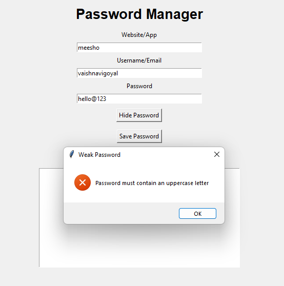

# Password Manager App
A simple Password Manager application built using Python and Tkinter.

# Features
- Stores Website Names
- Stores Usernames
- Save Passwords
- Strong Password Validation
- Requires Uppercase, Lowercase, Number & Special Symbol
- Shows Error for Weak Passwords
- GUI Interface
- Save Data in JSON File
- Show / Hide Password Feature

# Technologies Used
- Python
- Tkinter
- JSON

# Run
python aap.py

# Output

